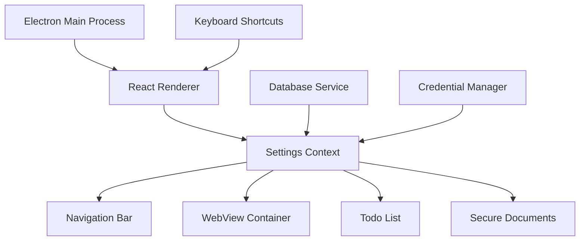

# BBZCloud Desktop Application

A modern, secure desktop application built with Electron and React that provides unified access to educational web applications and productivity tools. Originally developed for BBZ Rendsburg-Eckernförde, this application can be easily customized for any organization.


## 🌟 Features

### 🚀 **Core Functionality**
- **Unified Web App Access**: Seamlessly integrate multiple web applications in a single interface
- **Secure Credential Management**: Encrypted storage of login credentials using system keychain
- **Smart Auto-Login**: Automatic credential injection for supported applications
- **Role-Based Access Control**: Different app visibility based on user roles (teachers vs students)
- **Cross-Platform Support**: Works on Windows, macOS, and Linux

### ⌨️ **Productivity Features**
- **Comprehensive Keyboard Shortcuts**: Navigate efficiently with customizable hotkeys
- **Todo Management**: Built-in todo list with reminders and due dates
- **Secure Document Storage**: Encrypted file storage with AES encryption
- **Notification Detection**: Visual indicators for unread messages/notifications
- **Multi-Window Support**: Open applications in separate windows when needed

### 🎨 **User Experience**
- **Modern UI**: Clean, responsive interface built with Chakra UI
- **Dark/Light Theme**: Automatic theme switching based on user preference
- **Accessibility Support**: Full keyboard navigation and screen reader compatibility
- **Customizable Layout**: Adjustable zoom levels and flexible navigation bar
- **Auto-Updates**: Seamless application updates via GitHub releases

### 🔧 **Developer Features**
- **Modular Architecture**: Well-organized, commented codebase for easy customization
- **Comprehensive Documentation**: Detailed comments and setup instructions
- **ESLint Integration**: Code quality enforcement and consistency
- **GitHub Actions**: Automated building and releasing for multiple platforms
- **Hot Reload**: Fast development with live reloading

## 📋 Table of Contents

- [Quick Start](#-quick-start)
- [Installation](#-installation)
- [Customization Guide](#-customization-guide)
- [Architecture Overview](#-architecture-overview)
- [Development Setup](#-development-setup)
- [Building & Distribution](#-building--distribution)
- [Configuration](#-configuration)
- [Keyboard Shortcuts](#-keyboard-shortcuts)
- [Security Features](#-security-features)
- [Troubleshooting](#-troubleshooting)
- [Contributing](#-contributing)
- [License](#-license)

## 🚀 Quick Start

### Prerequisites
- Node.js 18+ and npm
- Git
- Python 3.x (for native module compilation)
- Platform-specific build tools:
  - **Windows**: Visual Studio Build Tools
  - **macOS**: Xcode Command Line Tools
  - **Linux**: build-essential package

### Installation

1. **Clone the repository**
   ```bash
   git clone https://github.com/dclausen01/bbzcloud-2.git
   cd bbzcloud-2
   ```

2. **Install dependencies**
   ```bash
   npm install
   ```

3. **Start development server**
   ```bash
   npm run electron-dev
   ```

4. **Build for production**
   ```bash
   npm run dist
   ```

## 🎨 Customization Guide

### 1. **Organization Branding**

**Update Application Identity:**
```javascript
// package.json
{
  "name": "your-org-app",
  "productName": "Your Organization App",
  "description": "Your custom description",
  "author": {
    "name": "Your Name",
    "email": "your.email@organization.com"
  }
}
```

**Replace Icons and Images:**
- Replace files in `assets/icons/` with your application icons
- Update `assets/images/icon.png` with your organization logo
- Modify `assets/images/logo.png` for branding

### 2. **Web Applications Configuration**

**Update URLs in `src/utils/constants.js`:**
```javascript
export const URLS = {
  // Replace with your organization's applications
  LEARNING_PLATFORM: 'https://your-lms.organization.com',
  EMAIL: 'https://mail.organization.com',
  OFFICE: 'https://office.organization.com',
  // Add more applications as needed
};
```

**Configure Navigation Buttons in `src/context/SettingsContext.js`:**
```javascript
const defaultSettings = {
  navigationButtons: {
    yourapp: {
      visible: true,
      url: URLS.YOUR_APP,
      title: 'Your App',
      buttonVariant: 'solid',
      zoom: ZOOM_CONFIG.DEFAULT_ZOOM
    },
    // Add more navigation buttons
  }
};
```

### 3. **User Role Management**

**Customize User Filtering in `src/App.js`:**
```javascript
const filterNavigationButtons = useCallback(() => {
  if (!settings.navigationButtons) return {};

  // CUSTOMIZE: Change this logic for your organization
  const isAdmin = email.endsWith('@admin.organization.com');
  const isTeacher = email.endsWith('@teacher.organization.com');
  
  if (isAdmin || isTeacher) {
    return settings.navigationButtons;
  }

  // Define apps for regular users
  const allowedApps = ['learning', 'email', 'office'];
  return Object.entries(settings.navigationButtons)
    .filter(([key]) => allowedApps.includes(key))
    .reduce((acc, [key, value]) => ({ ...acc, [key]: value }), {});
}, [email, settings.navigationButtons]);
```

### 4. **Localization**

**Update Messages in `src/utils/constants.js`:**
```javascript
export const ERROR_MESSAGES = {
  CONNECTION_INTERRUPTED: 'Connection was interrupted',
  SERVER_NOT_FOUND: 'Server could not be found',
  // Translate all messages to your preferred language
};

export const SUCCESS_MESSAGES = {
  LINK_COPIED: 'Link copied',
  SETTINGS_SAVED: 'Settings saved',
  // Translate all messages
};
```

### 5. **Keyboard Shortcuts**

**Customize Shortcuts in `src/utils/constants.js`:**
```javascript
export const KEYBOARD_SHORTCUTS = {
  TOGGLE_TODO: 'ctrl+t',           // Change to your preference
  TOGGLE_DOCS: 'ctrl+d',
  OPEN_SETTINGS: 'ctrl+comma',
  // Modify any shortcuts as needed
};
```

## 🏗️ Architecture Overview

### **Project Structure**
```
bbzcloud-2/
├── public/                     # Electron main process files
│   ├── electron.js            # Main Electron process
│   ├── preload.js             # Preload script for security
│   ├── webview-preload.js     # WebView preload script
│   └── services/              # Backend services
│       └── DatabaseService.js # SQLite database operations
├── src/                       # React renderer process
│   ├── components/            # React components
│   ├── context/               # React context providers
│   ├── hooks/                 # Custom React hooks
│   ├── utils/                 # Utility functions and constants
│   ├── App.js                 # Main React component
│   ├── index.js               # React entry point
│   └── theme.js               # Chakra UI theme configuration
├── assets/                    # Static assets
│   ├── icons/                 # Application icons
│   └── images/                # Images and logos
├── .github/workflows/         # GitHub Actions CI/CD
└── package.json               # Project configuration
```

### **Key Components**

1. **App.js**: Main application orchestrator
2. **SettingsContext.js**: Global state management
3. **WebViewContainer.js**: Manages embedded web applications
4. **NavigationBar.js**: Main navigation interface
5. **DatabaseService.js**: Handles data persistence
6. **useKeyboardShortcuts.js**: Keyboard shortcut management

### **Data Flow**



## 💻 Development Setup

### **Environment Setup**

1. **Install Node.js 18+**
   ```bash
   # Using nvm (recommended)
   nvm install 18
   nvm use 18
   ```

2. **Install Python and Build Tools**
   ```bash
   # Windows (run as administrator)
   npm install -g windows-build-tools
   
   # macOS
   xcode-select --install
   
   # Linux (Ubuntu/Debian)
   sudo apt-get install build-essential
   ```

3. **Clone and Setup**
   ```bash
   git clone https://github.com/dclausen01/bbzcloud-2.git
   cd bbzcloud-2
   npm install
   ```

### **Development Commands**

```bash
# Start development server with hot reload
npm run electron-dev

# Build React app only
npm run build

# Run tests
npm test

# Lint code
npm run lint

# Check for dependency updates
npm run check-updates

# Update dependencies
npm run update-deps
```

### **Debugging**

**Enable Developer Tools:**
```javascript
// In public/electron.js, set:
const isDev = true; // Force development mode
```

**Debug Renderer Process:**
- Press `Ctrl+Shift+I` (Windows/Linux) or `Cmd+Option+I` (Mac)
- Or use `View > Toggle Developer Tools` in the app menu

**Debug Main Process:**
```bash
# Start with Node.js debugging
npm run electron-dev -- --inspect=5858
```

## 📦 Building & Distribution

### **Build for All Platforms**
```bash
# Build for current platform
npm run pack

# Build for all platforms
npm run dist

# Build for specific platforms
npm run dist:win    # Windows
npm run dist:mac    # macOS
npm run dist:linux  # Linux
```

### **GitHub Actions Automation**

The project includes automated building via GitHub Actions:

1. **Push to main branch** triggers builds for all platforms
2. **Create a release tag** (e.g., `v2.0.39`) triggers release builds
3. **Artifacts are automatically uploaded** to GitHub Releases

**Manual Release Process:**
```bash
# Update version in package.json
npm version patch  # or minor/major

# Push with tags
git push origin main --tags

# GitHub Actions will automatically build and release
```

### **Code Signing (Optional)**

For production releases, configure code signing:

**Windows:**
```javascript
// In package.json build config
"win": {
  "certificateFile": "path/to/certificate.p12",
  "certificatePassword": "password"
}
```

**macOS:**
```javascript
// In package.json build config
"mac": {
  "identity": "Developer ID Application: Your Name"
}
```

## ⚙️ Configuration

### **Environment Variables**

Create a `.env` file for local development:
```env
# Development settings
ELECTRON_IS_DEV=true
DEBUG=true

# Database settings
DB_ENCRYPTION_KEY=your-encryption-key

# Update server (optional)
UPDATE_SERVER_URL=https://your-update-server.com
```

### **Application Settings**

**Default Configuration in `src/context/SettingsContext.js`:**
```javascript
const defaultSettings = {
  theme: 'light',                    // 'light' or 'dark'
  globalZoom: 1.0,                   // Default zoom level
  navbarZoom: 0.9,                   // Navigation bar zoom
  autostart: true,                   // Start with system
  minimizedStart: false,             // Start minimized
  // Add custom settings as needed
};
```

### **Database Configuration**

**SQLite Database Location:**
- **Windows**: `%APPDATA%/bbzcloud/database.db`
- **macOS**: `~/Library/Application Support/bbzcloud/database.db`
- **Linux**: `~/.config/bbzcloud/database.db`

**Credential Storage:**
- Uses system keychain (Windows Credential Manager, macOS Keychain, Linux Secret Service)
- Service name: `bbzcloud` (configurable in constants.js)

## ⌨️ Keyboard Shortcuts

### **Global Shortcuts**
| Shortcut | Action |
|----------|--------|
| `Ctrl+T` | Toggle Todo List |
| `Ctrl+D` | Toggle Secure Documents |
| `Ctrl+,` | Open Settings |
| `Ctrl+R` | Reload Current Page |
| `Ctrl+Shift+R` | Reload All Pages |
| `F11` | Toggle Fullscreen |
| `Escape` | Close Modal/Drawer |

### **Navigation Shortcuts**
| Shortcut | Action |
|----------|--------|
| `Ctrl+1-9` | Navigate to App 1-9 |

### **WebView Shortcuts**
| Shortcut | Action |
|----------|--------|
| `Alt+Left` | Go Back |
| `Alt+Right` | Go Forward |
| `F5` | Refresh Page |
| `Ctrl+P` | Print Page |

### **Adding Custom Shortcuts**

```javascript
// In your component
import { useKeyboardShortcuts } from './hooks/useKeyboardShortcuts';

const MyComponent = () => {
  const shortcuts = {
    'ctrl+shift+n': () => createNewItem(),
    'ctrl+alt+d': () => deleteItem(),
  };
  
  useKeyboardShortcuts(shortcuts);
  
  return <div>Your component</div>;
};
```

## 🔒 Security Features

### **Credential Management**
- **Encrypted Storage**: All credentials stored in system keychain
- **Auto-Injection**: Secure credential injection into web applications
- **No Plain Text**: Credentials never stored in plain text

### **Secure Documents**
- **AES Encryption**: Files encrypted with AES-256
- **Password Protection**: Additional password layer for sensitive documents
- **Secure Deletion**: Proper file deletion with overwriting

### **WebView Security**
- **Context Isolation**: WebViews run in isolated contexts
- **Content Security Policy**: Strict CSP headers
- **Permission Management**: Controlled access to system resources

### **Network Security**
- **HTTPS Enforcement**: All external connections use HTTPS
- **Certificate Validation**: Strict certificate checking
- **Proxy Support**: Corporate proxy compatibility

## 🐛 Troubleshooting

### **Common Issues**

**1. Application Won't Start**
```bash
# Clear cache and reinstall
rm -rf node_modules package-lock.json
npm install
```

**2. Build Failures**
```bash
# Rebuild native modules
npm run postinstall
```

**3. Credential Issues**
```bash
# Reset credentials (will require re-login)
# Windows: Remove from Credential Manager
# macOS: Remove from Keychain Access
# Linux: Clear with secret-tool
```

**4. Database Corruption**
```bash
# Backup and reset database
# Database location varies by platform (see Configuration section)
```

### **Debug Mode**

Enable debug logging:
```javascript
// In public/electron.js
const debug = require('debug')('bbzcloud');
debug('Debug message');
```

### **Performance Issues**

**Memory Usage:**
- Monitor with `Ctrl+Shift+I` > Performance tab
- Restart application if memory usage exceeds 1GB

**Slow Loading:**
- Check network connectivity
- Clear WebView cache: Settings > Advanced > Clear Cache

## 🤝 Contributing

### **Development Workflow**

1. **Fork the repository**
2. **Create a feature branch**
   ```bash
   git checkout -b feature/your-feature-name
   ```
3. **Make your changes**
4. **Test thoroughly**
   ```bash
   npm test
   npm run lint
   npm run electron-dev
   ```
5. **Commit with descriptive messages**
   ```bash
   git commit -m "feat: add new keyboard shortcut for quick search"
   ```
6. **Push and create a Pull Request**

### **Code Style**

- **ESLint**: Follow the configured ESLint rules
- **Comments**: Add comprehensive comments for complex logic
- **TypeScript**: Consider migrating to TypeScript for better type safety
- **Testing**: Add tests for new features

### **Pull Request Guidelines**

- **Clear Description**: Explain what your changes do and why
- **Screenshots**: Include screenshots for UI changes
- **Breaking Changes**: Clearly mark any breaking changes
- **Documentation**: Update README.md if needed

## 📄 License

This project is licensed under the MIT License - see the [LICENSE](LICENSE) file for details.

## 🙏 Acknowledgments

- **Electron Team**: For the excellent desktop application framework
- **React Team**: For the powerful UI library
- **Chakra UI**: For the beautiful component library
- **BBZ Rendsburg-Eckernförde**: For the original use case and requirements

## 📞 Support

- **Issues**: [GitHub Issues](https://github.com/dclausen01/bbzcloud-2/issues)
- **Discussions**: [GitHub Discussions](https://github.com/dclausen01/bbzcloud-2/discussions)
- **Email**: dennis.clausen@bbz-rd-eck.de

---

**Made with ❤️ for educational institutions and organizations worldwide.**
