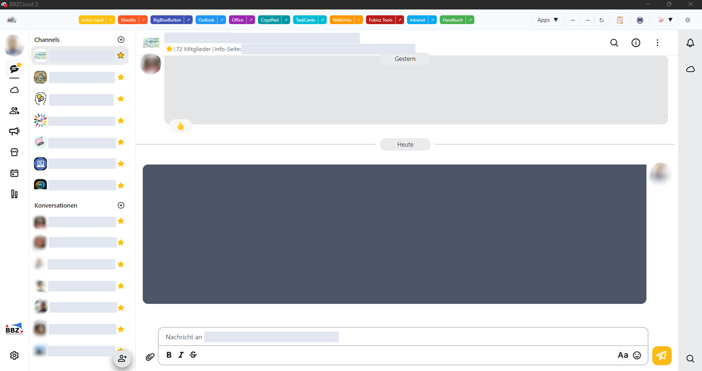

# BBZCloud Desktop Application

<div align="center">


**A unified desktop application for educational web services and collaboration tools**

[](https://github.com/dclausen01/bbzcloud-2)
[](LICENSE)
[](https://www.electronjs.org/)
[](https://reactjs.org/)

</div>

---

## 📖 Table of Contents

- [About](#about)
- [Features](#features)
- [Screenshots](#screenshots)
- [Technology Stack](#technology-stack)
- [Installation](#installation)
- [Building from Source](#building-from-source)
- [Development](#development)
- [Project Structure](#project-structure)
- [Customization Guide](#customization-guide)
- [Keyboard Shortcuts](#keyboard-shortcuts)
- [Configuration](#configuration)
- [Contributing](#contributing)
- [License](#license)
- [Contact](#contact)

---

## 🎯 About

BBZCloud is a cross-platform desktop application designed for educational institutions, specifically the BBZ Rendsburg-Eckernförde. It provides a unified interface for accessing various web-based educational tools and services in a single, streamlined application.

The application acts as a sophisticated web container with enhanced features including:

- Integrated todo list management
- Secure document storage
- Credential management via system keychain
- Customizable navigation for multiple web applications
- Role-based access control (teachers vs. students)
- Keyboard shortcuts for power users
- Auto-update functionality

---

## ✨ Features

### Core Functionality

- **Multi-App Navigation**: Quick access to multiple web applications in a single window
- **WebView Integration**: Isolated browsing contexts for each application with proper security
- **Credential Management**: Secure storage of login credentials using the system keychain (via keytar)
- **Role-Based Access**: Different app visibility for teachers and students based on email domain

### Productivity Features

- **📝 Todo List**: Built-in task management with reminders and markdown support
- **📄 Secure Documents**: Encrypted document storage with AES encryption
- **🔍 Command Palette**: Quick access to all features via keyboard (Ctrl+Shift+P)
- **⌨️ Keyboard Shortcuts**: Comprehensive keyboard navigation for power users
- **🔄 Auto-Updates**: Automatic application updates via GitHub releases

### User Interface

- **🎨 Theme Support**: Light and dark mode with system preference detection
- **📱 Responsive Design**: Adaptive layout using Chakra UI
- **♿ Accessibility**: Screen reader support and keyboard navigation
- **🖥️ System Tray**: Minimize to tray with notification badges
- **🪟 Multi-Window**: Support for opening apps in separate windows

### Developer Features

- **🐛 Debug Console**: Built-in debugging tools (Shift+Alt+Ctrl+D)
- **🔧 Custom Apps**: Add custom web applications via settings
- **💾 Data Sync**: Optional sync server for cross-device data synchronization
- **📊 Error Handling**: Comprehensive error tracking and reporting

---

## 📸 Screenshots



---

## 🛠️ Technology Stack

### Frontend

- **[React 18.3](https://reactjs.org/)** - UI framework
- **[Chakra UI 2.10](https://chakra-ui.com/)** - Component library
- **[Framer Motion](https://www.framer.com/motion/)** - Animation library
- **[React Markdown](https://github.com/remarkjs/react-markdown)** - Markdown rendering
- **[React DatePicker](https://reactdatepicker.com/)** - Date selection

### Backend/Desktop

- **[Electron 33.2](https://www.electronjs.org/)** - Desktop application framework
- **[SQLite3](https://www.sqlite.org/)** - Local database storage
- **[Keytar](https://github.com/atom/node-keytar)** - Native credential storage
- **[Electron Store](https://github.com/sindresorhus/electron-store)** - Settings persistence
- **[Electron Updater](https://www.electron.build/auto-update)** - Auto-update functionality

### Security

- **[Crypto-JS](https://github.com/brix/crypto-js)** - Encryption for secure documents
- **[UUID](https://github.com/uuidjs/uuid)** - Unique identifier generation

### Build Tools

- **[Electron Builder](https://www.electron.build/)** - Application packaging
- **[React Scripts](https://create-react-app.dev/)** - Build tooling
- **[Concurrently](https://github.com/open-cli-tools/concurrently)** - Script runner

---

## 📥 Installation

### Windows

1. Download the latest `BBZ-Cloud-{version}-x64.exe` from [Releases](https://github.com/dclausen01/bbzcloud-2/releases)
2. Run the installer
3. Follow the setup wizard
4. Launch BBZCloud from the Start Menu or Desktop shortcut

### macOS

1. Download the latest `BBZ-Cloud-{version}.dmg` from [Releases](https://github.com/dclausen01/bbzcloud-2/releases)
2. Open the DMG file
3. Drag BBZCloud to your Applications folder
4. Launch from Applications
5. If on a Apple Silicon Mac, right-click and select "Open" to bypass Gatekeeper on first run
6. If that doesn't work, you may need to allow the app in System Preferences > Security & Privacy > General or run:
   ```bash
   xattr -d com.apple.quarantine /Applications/BBZ-Cloud.app
   ```
   in Terminal.

### Linux

#### Debian/Ubuntu (.deb)

```bash
wget https://github.com/dclausen01/bbzcloud-2/releases/latest/download/BBZ-Cloud-{version}.deb
sudo dpkg -i BBZ-Cloud-{version}.deb
sudo apt-get install -f  # Install dependencies if needed
```

#### Arch Linux (.pacman)

```bash
wget https://github.com/dclausen01/bbzcloud-2/releases/latest/download/BBZ-Cloud-{version}.pacman
sudo pacman -U BBZ-Cloud-{version}.pacman
```

#### AppImage (Universal)

```bash
wget https://github.com/dclausen01/bbzcloud-2/releases/latest/download/BBZ-Cloud-{version}.AppImage
chmod +x BBZ-Cloud-{version}.AppImage
./BBZ-Cloud-{version}.AppImage
```

---

## 🏗️ Building from Source

### Prerequisites

- **Node.js** 18.x or higher
- **npm** or **yarn**
- **Git**
- **Python** 3.x (for native modules)
- **Build tools** (platform-specific)

#### Platform-Specific Requirements

**Windows:**

```bash
npm install --global windows-build-tools
```

**macOS:**

```bash
xcode-select --install
```

**Linux:**

```bash
sudo apt-get install build-essential libsqlite3-dev libsecret-1-dev
```

### Build Steps

1. **Clone the repository**

```bash
git clone https://github.com/dclausen01/bbzcloud-2.git
cd bbzcloud-2
```

2. **Install dependencies**

```bash
npm install
```

3. **Build the React app**

```bash
npm run build
```

4. **Build for your platform**

```bash
# Windows
npm run dist:win

# macOS
npm run dist:mac

# Linux
npm run dist:linux

# All platforms
npm run dist
```

The built applications will be in the `dist/` directory.

---

## 💻 Development

### Running in Development Mode

1. **Start the development server**

```bash
npm run electron-dev
```

This will:

- Start the React development server on http://localhost:3000
- Launch Electron with hot-reload enabled
- Enable React DevTools and Electron DevTools

2. **Development with specific configurations**

```bash
# Set environment variables
export ELECTRON_IS_DEV=1
npm run electron-dev
```

### Available Scripts

| Script                 | Description                         |
| ---------------------- | ----------------------------------- |
| `npm start`            | Start React development server only |
| `npm run build`        | Build React app for production      |
| `npm run electron-dev` | Start Electron in development mode  |
| `npm run dist`         | Build for all platforms             |
| `npm run dist:win`     | Build for Windows                   |
| `npm run dist:mac`     | Build for macOS                     |
| `npm run dist:linux`   | Build for Linux                     |
| `npm run pack`         | Package without creating installer  |
| `npm run release`      | Build and publish to GitHub         |
| `npm test`             | Run tests                           |

### Debugging

**Enable Debug Console:**

- Press `Shift+Alt+Ctrl+D` in the application
- View console logs, errors, and network activity

**Chrome DevTools:**

- Press `Ctrl+Shift+I` (Windows/Linux) or `Cmd+Option+I` (macOS)
- Access the full Chrome DevTools

---

## 📁 Project Structure

```
bbzcloud-2/
├── assets/                    # Application assets
│   ├── icons/                # App icons (SVG format)
│   └── images/               # Images (app icon, logo, etc.)
├── build/                    # Electron build configuration
├── docs/                     # Documentation
│   └── keyboard-shortcuts.md # Keyboard shortcuts guide
├── public/                   # Electron main process
│   ├── electron.js          # Main Electron entry point
│   ├── preload.js           # Preload script for main window
│   ├── webview-preload.js   # Preload script for webviews
│   ├── index.html           # Main window HTML
│   └── services/            # Backend services
│       └── DatabaseService.js # SQLite database management
├── server/                   # Optional sync server
│   └── sync/                # Data synchronization service
├── src/                     # React application source
│   ├── components/          # React components
│   │   ├── App.js          # Main application component
│   │   ├── NavigationBar.js # Top navigation
│   │   ├── TodoList.js     # Todo management
│   │   ├── SecureDocuments.js # Document storage
│   │   ├── CommandPalette.js # Command palette
│   │   ├── SettingsPanel.js # Settings UI
│   │   └── ...             # Other components
│   ├── context/            # React context providers
│   │   └── SettingsContext.js # Global settings
│   ├── hooks/              # Custom React hooks
│   │   ├── useKeyboardShortcuts.js # Keyboard handling
│   │   ├── useCredentials.js # Credential management
│   │   └── useWebViewSetup.js # WebView setup
│   ├── utils/              # Utility functions
│   │   ├── constants.js    # App constants
│   │   ├── errorHandler.js # Error handling
│   │   └── accessibility.js # A11y helpers
│   ├── styles/             # CSS files
│   ├── index.js            # React entry point
│   └── theme.js            # Chakra UI theme
├── web-notes/              # Deprecated notes feature
├── package.json            # Dependencies and scripts
└── README.md              # This file
```

---

## 🎨 Customization Guide

### Adding Custom Applications

1. **Via Settings Panel:**

   - Open Settings (⚙️ icon or `Ctrl+Shift+S`)
   - Navigate to "Custom Apps"
   - Click "Add Custom App"
   - Enter name, URL, and optional icon

2. **Via Configuration File:**
   Edit `src/context/SettingsContext.js` to add default apps:
   ```javascript
   navigationButtons: {
     myapp: {
       title: 'My App',
       url: 'https://myapp.example.com',
       icon: 'myapp',
       visible: true,
       order: 10
     }
   }
   ```

### Customizing for Your Organization

#### 1. Update Branding

Replace files in `assets/`:

- `images/icon.png` - Application icon
- `images/logo.png` - Application logo
- `images/icon.ico` - Windows icon

#### 2. Modify User Role Logic

Edit `src/App.js`, function `filterNavigationButtons()`:

```javascript
const filterNavigationButtons = useCallback(() => {
  if (!settings.navigationButtons) return {};

  // Change email domain check
  const isTeacher = email.endsWith("@your-domain.com");

  if (isTeacher) {
    return settings.navigationButtons;
  }

  // Customize allowed apps for students
  const allowedApps = ["app1", "app2", "app3"];
  return Object.entries(settings.navigationButtons)
    .filter(([key]) => allowedApps.includes(key))
    .reduce((acc, [key, value]) => ({ ...acc, [key]: value }), {});
}, [email, settings.navigationButtons]);
```

#### 3. Configure URLs

Edit `src/utils/constants.js`:

```javascript
export const DEFAULT_URLS = {
  SCHULCLOUD: "https://your-lms.com",
  MOODLE: "https://your-moodle.com",
  // Add more URLs
};
```

#### 4. Update Application Info

Edit `package.json`:

```json
{
  "name": "your-app-name",
  "description": "Your description",
  "author": {
    "name": "Your Name",
    "email": "your@email.com"
  },
  "build": {
    "appId": "com.yourcompany.app",
    "productName": "Your App Name"
  }
}
```

#### 5. Database Location

Default database location:

- **Windows:** `%APPDATA%/bbzcloud/database.db`
- **macOS:** `~/Library/Application Support/bbzcloud/database.db`
- **Linux:** `~/.config/bbzcloud/database.db`

Users can change this in the welcome modal or settings.

---

## ⌨️ Keyboard Shortcuts

### Global Shortcuts

| Shortcut       | Action                  |
| -------------- | ----------------------- |
| `Ctrl+Shift+T` | Toggle Todo List        |
| `Ctrl+Shift+D` | Toggle Secure Documents |
| `Ctrl+Shift+S` | Toggle Settings         |
| `Ctrl+Shift+P` | Open Command Palette    |
| `Ctrl+R`       | Reload Current WebView  |
| `Ctrl+Shift+R` | Reload All WebViews     |
| `F11`          | Toggle Fullscreen       |
| `Esc`          | Close Modal/Drawer      |

### Navigation Shortcuts

| Shortcut             | Action                  |
| -------------------- | ----------------------- |
| `Ctrl+1` to `Ctrl+9` | Navigate to App 1-9     |
| `Alt+Left`           | Go Back (in WebView)    |
| `Alt+Right`          | Go Forward (in WebView) |
| `F5`                 | Refresh Current Page    |
| `Ctrl+P`             | Print Current Page      |

### Debug & Development

| Shortcut           | Action               |
| ------------------ | -------------------- |
| `Shift+Alt+Ctrl+D` | Toggle Debug Console |
| `Ctrl+Shift+I`     | Open DevTools        |

For more details, see [docs/keyboard-shortcuts.md](docs/keyboard-shortcuts.md)

---

## ⚙️ Configuration

### Settings File

Settings are stored in:

- **Windows:** `%APPDATA%/bbzcloud/config.json`
- **macOS:** `~/Library/Application Support/bbzcloud/config.json`
- **Linux:** `~/.config/bbzcloud/config.json`

### Credential Storage

Credentials are securely stored in the system keychain:

- **Windows:** Windows Credential Manager
- **macOS:** Keychain Access
- **Linux:** libsecret (GNOME Keyring or KWallet)

### Environment Variables

```bash
# Enable development mode
ELECTRON_IS_DEV=1

# Custom database path
BBZCLOUD_DB_PATH=/path/to/database.db

# Disable auto-updates
DISABLE_AUTO_UPDATE=1
```

---

## 🤝 Contributing

We welcome contributions! Please follow these guidelines:

1. **Fork the repository**
2. **Create a feature branch**
   ```bash
   git checkout -b feature/amazing-feature
   ```
3. **Commit your changes**
   ```bash
   git commit -m 'Add amazing feature'
   ```
4. **Push to the branch**
   ```bash
   git push origin feature/amazing-feature
   ```
5. **Open a Pull Request**

### Code Style

- Use ESLint configuration provided
- Follow React best practices
- Add comments for complex logic
- Write meaningful commit messages

### Reporting Bugs

- Use the [GitHub Issues](https://github.com/dclausen01/bbzcloud-2/issues) page
- Include steps to reproduce
- Provide system information
- Attach screenshots if applicable

---

## 📄 License

This project is licensed under the MIT License - see the [LICENSE](LICENSE) file for details.

---

## 📧 Contact

**Author:** Dennis Clausen  
**Email:** dennis.clausen@bbz-rd-eck.de  
**GitHub:** [@dclausen01](https://github.com/dclausen01)

**Project Link:** [https://github.com/dclausen01/bbzcloud-2](https://github.com/dclausen01/bbzcloud-2)

---

## 🙏 Acknowledgments

- [Electron](https://www.electronjs.org/) - Cross-platform desktop framework
- [React](https://reactjs.org/) - UI library
- [Chakra UI](https://chakra-ui.com/) - Component library
- BBZ Rendsburg-Eckernförde - For supporting this project

---

## 📊 Project Status


---

<div align="center">
Made with ❤️ for Education
</div>
